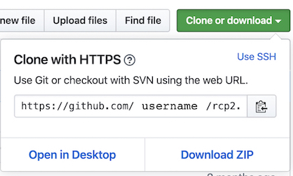

# Getting Started with Red Cross Fire Risk Phase 2
3/30/20

This guide walks through many of the steps necessary to get up and running with<br>
the Red Cross Fire Risk Project.

## Key Tools
Here are the main tools that we use.
1. Datakind DC Slack, [click to join](https://dkdc.herokuapp.com/)
2. [Github repository](https://github.com/DataKind-DC/rcp2/)
3. Google Drive (link in the rcp2_public Slack channel)
4. Python (Recommended but not required)

### Slack
If you're not already part of the DataKind DC Slack group, [click to join](https://dkdc.herokuapp.com/)

Join the `rcp2_public` channel.

### Github
For those that are new to Git/Github, we recommend installing [Github Desktop](https://desktop.github.com/).

You will need a free, personal account with Github.  You can [sign up here](https://github.com/join).

#### Workflow
We use forks so multiple people can be working on copies of the repository without<br>
interfering with one another.

The diagram below shows our general process, with the numbers corresponding<br>
to the detailed instructions below:


1. [Sign in](https://github.com/login) to your Github account
2. Fork the main repo
	* Go to the [main repository page](https://github.com/DataKind-DC/rcp2/)
	* Click the fork button in the top right 
3. Clone the your forked copy of the repository to your local machine
    * Via Github Desktop
        * Sign in to your Github account
        * Select username/rcp2 from the list of repositories on the right
        * Click the "Clone username/rcp2" button on the bottom right
    * Via the web and command line
        * Navigate to your forked version of the repository on Github <br>
        (it'll be at github.com/[username]/rcp2, with your Github username)
        * Click the clone or download button 
        * Copy the url in the text box 
        * At the command line, navigate to the local folder you want to clone to, <br> then type: `git clone [link]`, pasting in the link
4. Make edits to files and/or create new ones (this is where you do the work)
5. Commit your changes
    * Via Github Desktop
        * Select the changes you want to commit from the left pane
        * Add a summary explaining your changes
        * Click the "Commit to master" button
    * Via the command line
        * Run `git status` to check what files have been modified/added
        * Run `git add [file]` on each file you want to include
        * Run `git commit -m "some message"` to commit your changes
6. Push your commit(s) to your forked copy of the repository
    * Via Github Desktop
        * Select Repository > Push from the menu bar OR <br>
        click the "Push Origin" button
    * Via the command line
        * Run `git push origin rcp2`
7. When your changes are ready for review, create a pull request to merge your <br> fork into the main repository
    * Navigate to your forked version of the repository on Github
    * Click the pull request button 
    * Follow the prompts
8. A project lead will review, and then merge, your pull request into the main repository


### Google Drive
The project data is stored on Google Drive since most of the files are too large<br>
for Github.  The repository is set up to ignore changes in its Data folder to<br>
help avoid accidental uploads to Github.

1. Navigate to the Google Drive folder online
    * You can get the link from the rcp2_public channel on Slack
2. Download the "Master Project Data" folder found in: RCP2 > 02_data > Master Project Data
    * There's a lot of data so this may take a while
3. Unzip the downloaded file(s)
4. Move the Master Project Data folder under the Data folder in your local<br>
copy of the Github repository

### Python (Recommended but not required)
Download [Anaconda](https://www.anaconda.com/distribution/#download-section) <br>
Choose the Python 3.7 version

#### Virtual Environment
We have set up a Python virtual environment with the necessary dependencies for<br>
much of our existing code.  This step is optional, even for those using Python.

1. Go to command line (or Anaconda terminal) and navigate to your local rcp2 folder<br>
(often something like documents/github/rcp2)
2. Run the following commands
  ```
  conda create -n RCP2 python=3 -c conda-forge
  conda activate RCP2
  conda install --file requirements.txt
  ```
  This will create your environment and activate it, so you'll be ready to go.

-----

## Next Steps

#### Read Up
There are lots of great resources in the Drive folder, in both Master Project<br>
Data and 01_project_overview > Additional reading

#### Find a Task
Click on the Projects tab above and then the RC project (or [here](https://github.com/DataKind-DC/rcp2/projects/1)) to get a look at all the current tasks.
